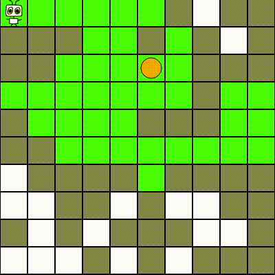
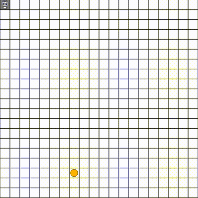

# AIXIjs


[](https://github.com/google/gts)

AIXIjs is a JavaScript demo for running reinforcement learning (RL) agents in the browser. In particular, it provides a general and extensible framework for running experiments on Bayesian model-based RL agents in general (partially observable, non-Markov, non-ergodic) environments.

 

NOTE: This version (V2) is currently work-in-progress.


## License
GPL.

## Citing AIXIjs

If you use this software in your own work, please cite it as:

```
@inproceedings{ALH2017,
 author = {Aslanides, John and Leike, Jan and Hutter, Marcus},
 title = {Universal Reinforcement Learning Algorithms: Survey and Experiments},
 booktitle = {Proceedings of the Twenty-Sixth International Joint Conference on Artificial Intelligence},
 series = {IJCAI'17},
 year = {2017},
 publisher = {AAAI Press},
}
```

## Contributing

If you'd like to contribute, I'm all ears! There's a lot of stuff to do :) Go ahead and open a pull request!
